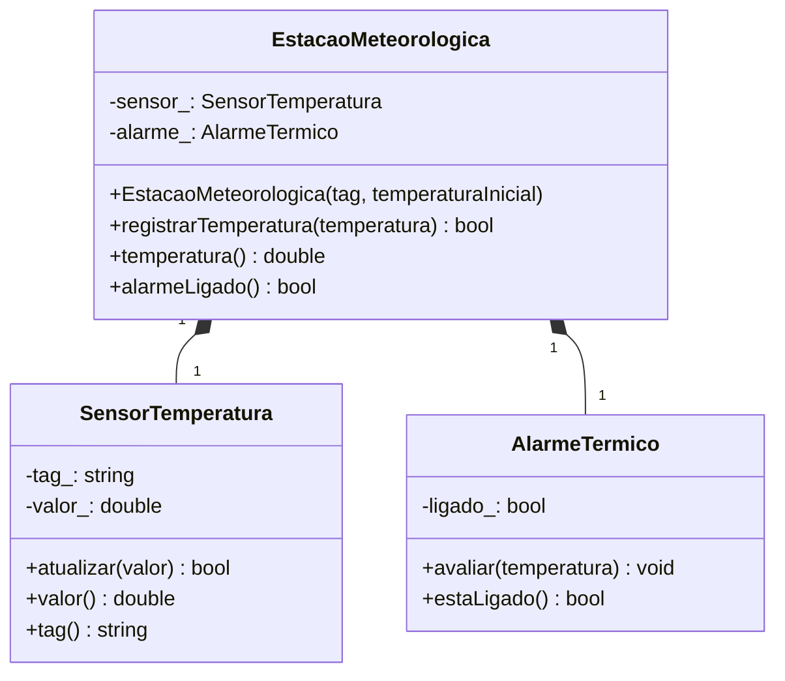

# Diagrama da estação meteorológica

```mermaid
classDiagram
    class SensorTemperatura {
        -tag_: string
        -valor_: double
        +atualizar(valor) bool
        +valor() double
        +tag() string
    }

    class AlarmeTermico {
        -ligado_: bool
        +avaliar(temperatura) void
        +estaLigado() bool
    }

    class EstacaoMeteorologica {
        -sensor_: SensorTemperatura
        -alarme_: AlarmeTermico
        +EstacaoMeteorologica(tag, temperaturaInicial)
        +registrarTemperatura(temperatura) bool
        +temperatura() double
        +alarmeLigado() bool
    }

    EstacaoMeteorologica "1" *-- "1" SensorTemperatura
    EstacaoMeteorologica "1" *-- "1" AlarmeTermico
```
